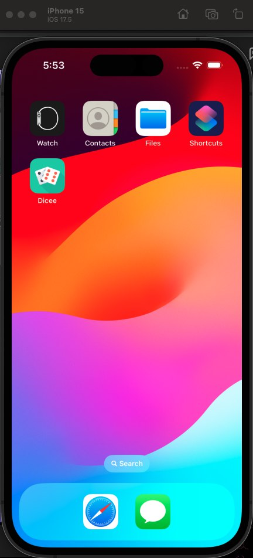
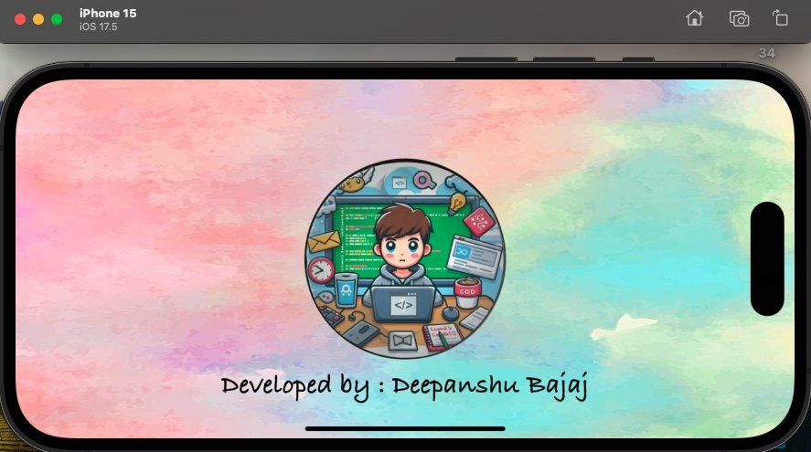
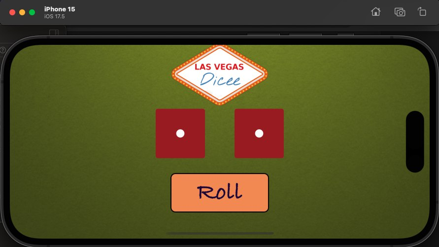
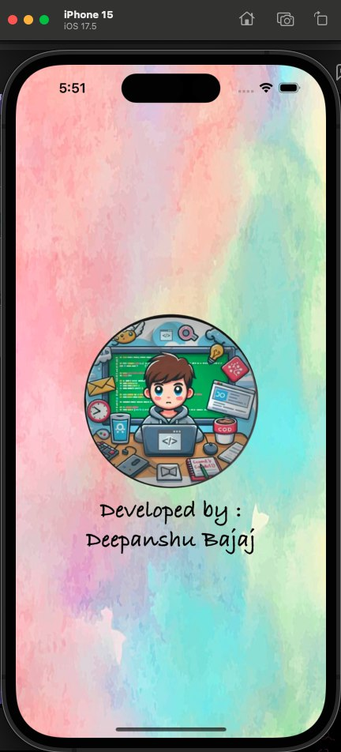
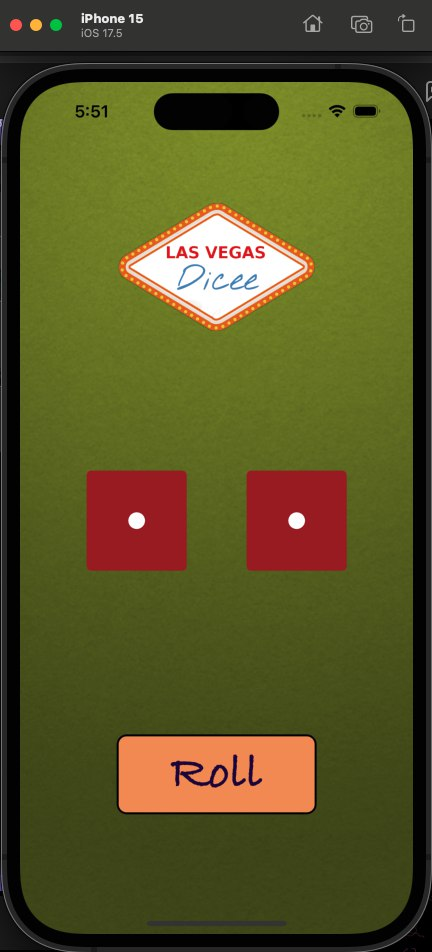

<h1 align="center">Dicee - iOS App</h1>

**Dicee** is an iOS app that simulates a Las Vegas-style dice roll experience. You can roll the dice by pressing a button, this app lets you settle any score, roll, or game on the go. It's a fun and interactive way to bring the excitement of dice games to your pocket!

## Features :

- **Dice Roll**: Press the "Roll" button to roll the dice and generate a random number.
- **Animated Dice**: The dice are animated, making the app visually fun and engaging.
- **Responsive UI**: The app uses programmatic UI layout with Swift and Auto Layout to ensure that it looks great on any device.

## Installation :

To run this project locally:

1. Clone the repository:
    ```bash
    git clone https://github.com/deepanshubajaj/Dicee-iOSApp.git
    ```

2. Open the project in Xcode:
    ```bash
    open Dicee.xcodeproj
    ```

3. Build and run the app on a simulator or physical device.

> Configure the project appropriately.

## App Look :

<p align="center">
  
</p>
<p align="center">
  *App snapshot in the simulator.*
</p>

## Screenshots :

<p align="center">
  
  *Splash screen displayed upon app launch in Landscape mode.*
</p>

<p align="center">
  
  *Screenshot of the Dicee app showing the dice roll screen in Landscape mode.*
</p>

<p align="center">
  
  
</p>

<p align="center">
  *Splash screen displayed upon app launch in Portrait mode.* &nbsp;&nbsp; *Screenshot of the main screen in Portrait mode.*
</p>

## App Icon :

<p align="center">
  
</p>
<p align="center">
  *The app icon represents the theme of dice rolling game.*
</p>

## Video Demo :

Here’s a short video showcasing the app's functionality:

<p align="center">
  
</p>

[Watch Working Video](ProjectOutputs/WorkingVideo/workingVideo.mov)
